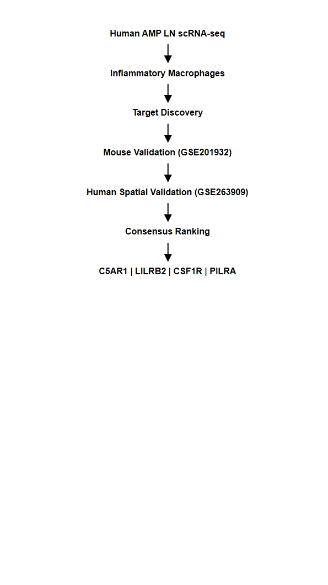
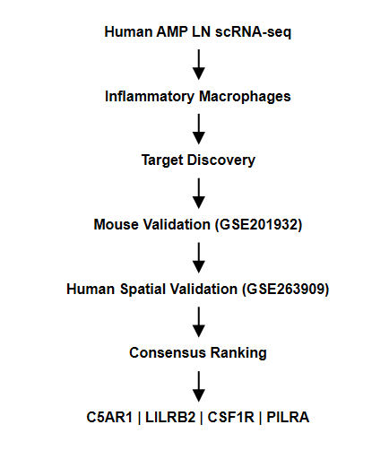
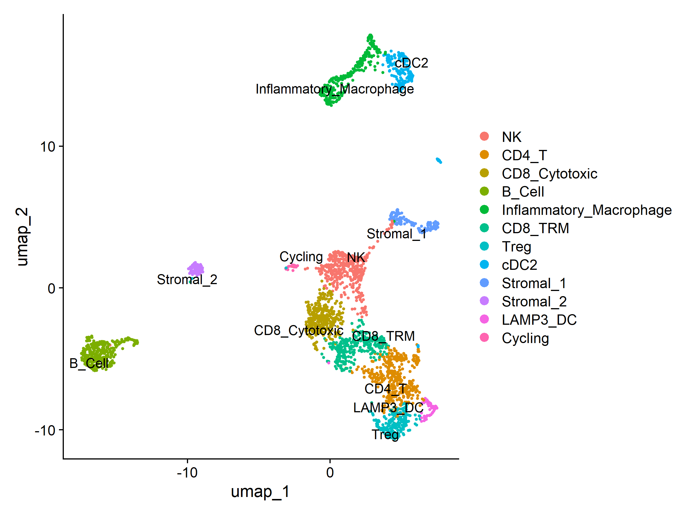

<p align="center">
  
</p>

# Cross-Species Therapeutic Target Discovery in Lupus Nephritis

An end-to-end computational framework for therapeutic target discovery through the integration of human single-cell RNA sequencing, mouse validation, and human spatial transcriptomics.

---

## Quick Facts

| | |
|--------------------------|--------------------------------------------|
| **Disease** | Lupus Nephritis |
| **Focus** | Therapeutic Target Discovery |
| **Species** | Human + Mouse |
| **Technologies** | Single-cell RNA-seq, Spatial Transcriptomics |
| **Programming Language** | R |
| **Primary Output** | Consensus Therapeutic Target Ranking |
| **Lead Candidate** | **C5AR1** |

---

## Overview

This repository presents a fully reproducible computational workflow for therapeutic target discovery in lupus nephritis by integrating independent human and mouse transcriptomic datasets.

The workflow combines human single-cell RNA sequencing, cross-species validation, and human spatial transcriptomics to prioritize macrophage-associated therapeutic targets supported by multiple independent lines of biological evidence.

This repository demonstrates how reproducible computational biology can accelerate therapeutic target discovery and support translational research in autoimmune disease.

---

## Highlights

- Cross-species therapeutic target discovery workflow
- Integration of three independent transcriptomic datasets
- Human, mouse, and spatial validation
- Fully reproducible end-to-end computational pipeline
- Evidence-based therapeutic target prioritization
- Identification of **C5AR1** as the highest-confidence therapeutic target

---

## Scientific Motivation

Inflammatory macrophages play a central role in kidney injury during lupus nephritis.

Therapeutic target discovery based on a single dataset often identifies candidates with limited reproducibility.

This project addresses this challenge by integrating:

- Human single-cell RNA sequencing
- Mouse single-cell RNA sequencing
- Human spatial transcriptomics
- Cross-species validation
- Spatial validation

to identify therapeutic targets consistently associated with inflammatory macrophages across independent datasets and technologies.

---

## Workflow

<p align="center">

</p>

---

## Repository Structure

```text
Cross-Species-Therapeutic-Target-Discovery/

├── data/
│   └── README.md
│
├── docs/
│   ├── 01_Project_Summary.md
│   ├── 02_Executive_Summary.md
│   └── 03_Methodology.md
│
├── figures/
│   └── README.md
│
├── results/
│   └── README.md
│
├── scripts/
│   └── README.md
│
├── requirements.md
├── LICENSE
└── README.md
```

---

## Documentation

Additional project documentation is available in:

- [Project Summary](docs/01_Project_Summary.md)
- [Executive Summary](docs/02_Executive_Summary.md)
- [Methodology](docs/03_Methodology.md)
- [Data Documentation](data/README.md)
- [Scripts](scripts/README.md)
- [Results](results/README.md)
- [Figures](figures/README.md)

---

## Datasets

| Dataset | Species | Technology | Purpose |
|----------|----------|------------|---------|
| AMP Lupus Nephritis (SDY997) | Human | Single-cell RNA sequencing | Target discovery |
| GSE201932 | Mouse | Single-cell RNA sequencing | Cross-species validation |
| GSE263909 | Human | Spatial transcriptomics | Independent validation |

The processed datasets are not redistributed because of GitHub file size limitations.

Instructions for downloading the original public datasets are provided in the **data/** directory.

---

## Computational Pipeline

The workflow integrates multiple layers of biological evidence:

- Quality control and preprocessing
- Cell type annotation
- Identification of inflammatory macrophages
- Differential gene expression analysis
- Cross-species validation using an independent mouse dataset
- Independent validation using human spatial transcriptomics
- Integrated evidence-based therapeutic target prioritization

This multi-step strategy improves confidence in biologically meaningful therapeutic targets.

---

## Main Results

The computational workflow generated:

- Human inflammatory macrophage atlas
- Differential macrophage marker analysis
- Candidate therapeutic target identification
- Cross-species validation
- Human spatial transcriptomic validation
- Spatial macrophage correlation analysis
- Consensus therapeutic target ranking

Together, these analyses prioritize macrophage-associated therapeutic candidates supported by multiple independent datasets.

---

## Key Findings

The highest-confidence therapeutic targets identified were:

| Rank | Target | Supporting Evidence |
|------|---------|---------------------|
| **1** | **C5AR1** | Human scRNA-seq • Mouse scRNA-seq • Human spatial validation |
| **2** | **LILRB2** | Human scRNA-seq • Human spatial validation |
| **3** | **CSF1R** | Human scRNA-seq • Mouse validation • Spatial macrophage correlation |
| **4** | **PILRA** | Human scRNA-seq • Mouse validation • Spatial macrophage correlation |

Among these candidates, **C5AR1** demonstrated the strongest overall evidence through:

- Strong enrichment within inflammatory macrophages
- Conserved expression across species
- Increased expression in independent human spatial transcriptomic data
- Positive spatial correlation with macrophage-rich inflammatory regions

These findings support **C5AR1** as a promising therapeutic candidate for future functional investigation.

---

## Biological Significance

The integrated analysis suggests that inflammatory macrophages in lupus nephritis are characterized by coordinated activation of:

- Complement signaling
- Myeloid activation pathways
- Innate immune receptors
- Macrophage differentiation programs

These pathways represent promising opportunities for therapeutic intervention.

---

## Example Results

### Human Single-Cell Atlas

<p align="center">

</p>

---

### Cross-Dataset Evidence

<p align="center">

</p>

---

### Final Therapeutic Target Ranking

<p align="center">

</p>

---

## Technologies

### Programming

- R

### Bioinformatics

- Seurat
- GEOquery
- clusterProfiler
- dplyr
- ggplot2
- patchwork

### Analytical Methods

- Single-cell RNA sequencing
- Spatial transcriptomics
- Differential gene expression analysis
- Cross-species validation
- Translational target discovery

---

## Limitations

Several limitations should be considered.

- Human and mouse immune systems are not identical.
- Spatial transcriptomics has lower cellular resolution than single-cell RNA sequencing.
- Computational prioritization does not establish functional causality.
- Independent validation in additional lupus nephritis cohorts would further strengthen confidence.

Despite these limitations, convergence across multiple independent datasets substantially increases confidence in the prioritized therapeutic targets.

---

## Future Directions

Planned extensions include:

- Validation in additional lupus nephritis cohorts
- Cell–cell communication analysis
- Human genetic (GWAS) integration
- Druggability assessment
- AI-assisted therapeutic target prioritization
- Multi-omic data integration

---

## Reproducibility

The complete analysis is fully reproducible.

Execute the scripts sequentially:

```text
01_human_discovery.R
        │
        ▼
02_target_prioritization.R
        │
        ▼
03_mouse_validation.R
        │
        ▼
04_spatial_validation.R
        │
        ▼
05_consensus_ranking.R
```

All intermediate tables, final rankings, and publication-quality figures are generated automatically.

---

## Portfolio Roadmap

This repository is the first project in a broader Computational Immunology and AI portfolio focused on:

- Cross-species therapeutic target discovery
- Cell–cell communication analysis
- AI-assisted therapeutic target prioritization
- Precision medicine
- Multi-omics integration

---

## Author

Independent computational biology and AI project focused on:

- Translational Immunology
- Autoimmune Disease
- Single-cell Transcriptomics
- Computational Biology
- Therapeutic Target Discovery
- Machine Learning
- Precision Medicine
